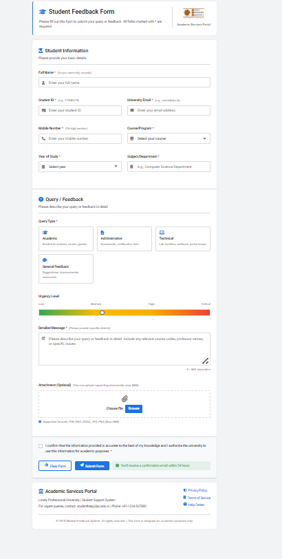

# Feedback Form

A simple **Feedback Form** built with **HTML, CSS, and JavaScript** to collect user comments, suggestions, or issues in a clean, responsive interface. This form can be used as a stand-alone static project or integrated with backend services to store responses. :contentReference[oaicite:1]{index=1}

---

## 🚀 Features

- 📄 Clean and intuitive user interface  
- 🔎 Basic form validation (required fields, email format, etc.)  
- 📱 Responsive layout for mobile and desktop  
- 🛠️ Easy to customize for different use cases  
- 💾 Ready for backend integration (e.g., server or Google Sheets) :contentReference[oaicite:2]{index=2}

---

## 🧱 Tech Stack

- **HTML** – Structure of the form  
- **CSS** – Styling and layout  
- **JavaScript** – Form logic and validation :contentReference[oaicite:3]{index=3}

---

## 📸 Screenshots

### 🔹 Feedback Form UI


### 🔹 After Form Submission


> 📌 **Note:**  
> - Make sure image names match exactly  
> - Screenshots must be uploaded inside the `screenshots` folder  

---

## 🚀 How to Run the Project

1. Clone the repository:
   ```bash
   git clone https://github.com/sachin-gautam-12/feed-back-form.git

## 📁 Project Structure

